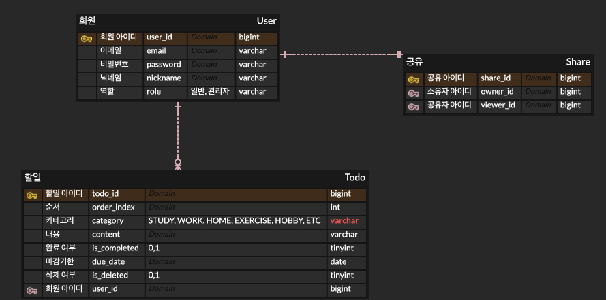

# 공유 ToDo 리스트 서비스

## 목차

- [공유 ToDo 리스트 서비스](#공유-todo-리스트-서비스)
    - [빠른 실행](#빠른-실행)
    - [기능 구현](#기능-구현)
        - [요구사항](#요구사항)
        - [고려사항](#고려사항)
    - [프로젝트 구성 요소](#프로젝트-구성-요소)
        - [기술스택](#기술스택)
        - [ERD](#erd)
        - [API 명세서](#api-명세서)
        - [디렉토리-구조](#디렉토리-구조)
    - [설계 시 고민한 지점](#설계-시-고민한-지점)
        - [Todo 업데이트 테스트 검증 문제](#todo-업데이트-테스트-검증-문제)
        - [ToDo 순서 정렬 설계](#todo-순서-정렬-설계)
        - [추가 구현하면 좋을 것](#추가-구현하면-좋을-것)
<br>
      
## 빠른 실행
1. 프로젝트 클론
    ```bash
    git clone https://github.com/hyun2371/ToDoList.git
    ```

2. 데이터베이스 설정
   src/main/resources/application.yml파일에서 MySQL 접속 정보를 설정합니다.

    ```yml
    spring:
      datasource:
        url: jdbc:mysql://localhost:3306/todolist
        username: {mysql 계정 아이디}
        password: {mysql 비밀번호}
    ```
3. 데이터베이스 초기화<br>
   src/main/resources/sql/init.sql을 실행해 초기 테이블을 생성합니다. <br><br>

4. 테스트 환경 준비<br>
   Docker Desktop을 실행합니다. <br><br>
5. 애플리케이션 실행 <br>

    ```bash
    /gradlew bootRun
    ```
<br>

## 기능 구현
### 요구사항
- [x]  사용자는 ToDo를 생성/조회/수정/삭제할 수 있어야 함
- [x]  ToDo를 생성한 사용자를 구분할 수 있어야 함
- [x]  태그로 ToDo의 카테고리를 분류할 수 있어야 함
- [x]  생성일, 마감일, D-Day 정보를 포함해야 함
- [x]  ToDo 항목의 순서를 변경할 수 있어야 함
- [x]  사용자, 태그, 완료 여부를 조건으로 ToDo를 필터링할 수 있어야 함
- [x]  ToDo를 다른 사용자에게 조회만 가능한 상태로 공유할 수 있어야 함
- [x]  ToDo를 생성한 사용자만 수정/삭제할 수 있어야 함
<br>

### 고려사항
- 현재 관리자(admin)의 ToDo 수정/삭제 권한  정책이 결정되지 않은 상황<br>
  → role admin 추가
- 차후에 삭제한 ToDo를 되돌리는 요구사항이 추가될 수 있음<br>
  → SoftDelete 추가
<br>

## 프로젝트 구성 요소
### 기술스택
- **Language**: Java 17
- **Framework**: Spring Boot 3.3
- **Database**: MySQL 8.0
- **ORM**: Spring Data JPA, QueryDSL 5
- **Validation**: Spring Validation
- **API Docs**: Springdoc OpenAPI (Swagger UI)
- **Test**: JUnit5, Spring Boot Test, Testcontainers
- **Build Tool**: Gradle

<br>

### API 명세서
- 애플리케이션 실행 후 접속
  http://localhost:8080/swagger-ui/index.html


### ERD


<br><br>

### 디렉토리 구조
```
src
├── main
│   └── java/org/pwc/todo
│        ├── common        # 공통 설정, 예외, 공용 DTO, 베이스 엔티티
│        ├── user          # 사용자 도메인 (회원 엔티티, repo)
│        ├── todo          # ToDo CRUD, 순서 변경, 필터링 등 핵심 기능
│        └── share         # ToDo 공유 기능 (조회 권한 관리)
│
└── test
    └── java/org/pwc/todo
         ├── support       # 공통 테스트 베이스 (TestContainer, JPA 설정 등)
         ├── todo          # ToDo 통합 테스트, 단위테스트
         └── share         # 공유 기능 통합 테스트
```
<br>

## 설계 시 고민한 지점

### Todo 업데이트 테스트 검증 문제

문제

- category 필드를 업데이트 한 후 이전 값과 비교해도 검증이 실패하지 않았다.

    ```java
    assertThat(updatedTodo.getCategory()).isEqualTo(prevTodo.getCategory());
    ```

원인

- 테스트 메서드에 @Transactional이 붙어 있었다.
    - 테스트가 하나의 트랜잭션 안에서 실행되어 updateTodo() 호출로 dirty checking이 일어나면 prevTodo도 변경된다.
    - prevTodo, updatedTodo가 동일 엔티티를 공유하게 된다.

해결

- 테스트 메서드의 @Transactional 제거
- 트랜잭션이 분리되어 영속성 컨텍스트도 분리된다.
- 동일 컨텍스트를 공유하지 않으므로 prevTodo는 이전 상태를 유지한다.

배운점

- 테스트 메서드에서 @Transactional을 함부로 사용하면 안된다.
- 하나의 트랜잭션 안에서 테스트가 실행되면 영속성 컨텍스트가 공유되어 의도한 테스트가 실패할 수 있다.
- 테스트에서는 엔티티 조회 → 변경 → 재조회를 검증해야 하므로 트랜잭션을 분리하는 것이 중요하다.

<br>

### ToDo 순서 정렬 설계

순서 정렬 구현 방식

- ToDo에 orderIndex 값을 저장하고 순서 변경 시 orderIndex를 한 번에 증가/감소 시켰습니다.
- 조회 시 orderIndex 기준으로 정렬해 순서를 보장했습니다.

Redis 사용하지 않은 이유

- 순서 변경이 빈번하나 bulk update를 사용하면 부하가 크지 않을 것이라고 판단했습니다.
- Redis와 DB 간 데이터 정합성을 관리하는 것이 큰 비용이라고 생각했습니다.

<br>

### 추가 구현하면 좋을 것

- 토큰 기반 사용자 인증 (JWT)
    - 추후 사용자 인증이 추가된다면 Controller의 userId 전달을 JWT claim으로 대체할 수 있습니다.